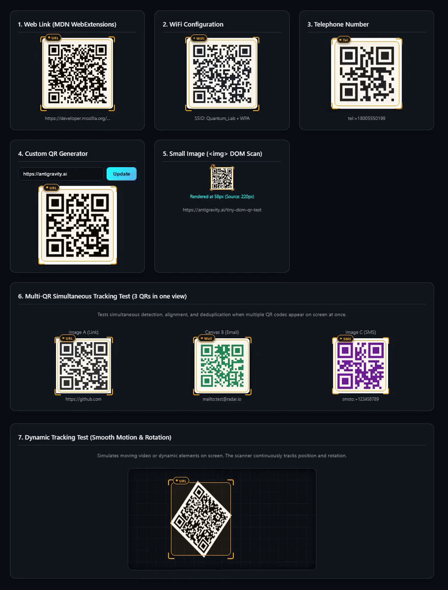

  

  # QR Radar

  **Real-Time Screen QR Scanner for Firefox**

  A Firefox extension that detects and reads QR codes on your screen in real time. Works across web pages, video streams, images, and canvas elements.

---

## Features

- **Real-Time Stream Processing**: Uses hardware-accelerated tab/screen capture to inspect visual output directly, bypassing CORS issues with cross-origin images or video players (YouTube, Vimeo, WebGL games).
- **Zero-Latency Decoding**: Powered by `jsQR` with configurable FPS throttling (8 / 15 / 30 FPS) and smart frame downscaling.
- **Dynamic HUD & Bounding Box**:
  - Glowing neon cyan & emerald corner reticles tracking the QR polygon.
  - Floating HUD card with automatic classification (URLs, WiFi credentials, Email, Phone numbers, SMS, Plain text).
  - One-click "Copy to Clipboard" with feedback animation.
  - "Open in New Tab" button for URLs.
- **Auditory Cue**: Subtle synth chime on new QR code detection via Web Audio API.
- **Popup Control Center**:
  - Start / Stop toggle button with live status pulse.
  - Scan rate presets (Eco 8 FPS, Balanced 15 FPS, High 30 FPS).
  - Scan history with timestamps and one-click copy.
  - Auto-copy to clipboard toggle.
- **Hotkeys**: Press <kbd>Alt</kbd> + <kbd>Q</kbd> anywhere to instantly toggle the scanner.

  

